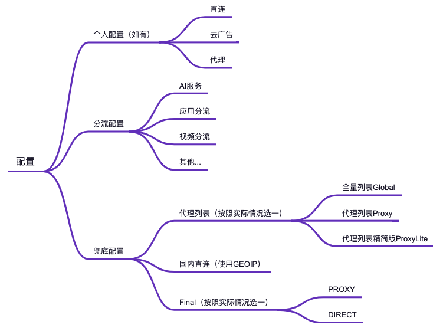

# Profiles

规则配置模板

配置一般提供3种配置

- `Full` 完整版，提供常见分流的完整配置，包含自定义代理，AI服务，苹果服务，谷歌服务，微软服务，游戏平台，奈飞视频，油管服务，巴哈姆特，迪士尼，电报消息以及国内外媒体配置
- `Lite` 精简版，提供最常用的通用的配置，提供自定义代理，AI服务，YouTube，Telegram和国外媒体配置（个人色彩极强的一个配置）
- `Mini` 极简版，仅提供最基础的分流配置，保留自定义代理，AI服务和国外媒体配置（其他常见分流直接焊死使用自定义代理访问）

# 配置说明

配置分为3个部分

- 个人配置，个人设定，如某些站点或者端口需要直连等
- 分流配置，一般是去广告，应用分流，或者视频的分流配置，如YouTuBe，Netflix等
- 兜底配置，这里的兜底不是全局兜底，是指一些默认的如需要代理的列表统一代理，国内域名统一直连的兜底，最后还包含Final（真正的兜底）

个人配置和分流配置一般按需配置即可

兜底配置中，主要的是兜底部分（指最后的Final兜底配置）的处理，分为2种情况

- 代理，即除了配置中的规则分流外，统一代理
  - 需配置GEOIP规则走直连，可以无须再配置Global/Proxy/ProxyLite规则（除非有特殊要求，建议直接在个人配置中设定）
- 直连，即除了配置中的规则分流外，统一直连
  - 因兜底也是直连，所以需要配置Global/Proxy/ProxyLite规则，可无须配置GEOIP（会走到默认兜底，若有需要代理的站点，可在个人配置中设定）

兜底全配置会出现一些意料之外的情形（如App Store下载时的连接iosapps.itunes.apple.com会命中到Global_Classical_No_Resolve配置走代理），当然也可以使用ProxyLite配置。

这里回归基础流程，实现按需分流，其余的国内走直连，国外走代理

~~基于以上的情形，考虑到当前手机设备性能基本过剩，以及软路由性能也一般不会太差的情况，兜底配置使用全配置（即既配置代理规则，也配置GEOIP国内直连规则）~~

~~但全配置也会出现一些意外的情况~~

- ~~兜底代理规则有3种（Global/Proxy/ProxyLite，是一种包含关系）。分流配置中的规则列表，有较大概率出现在兜底代理的规则中，造成配置冗余（但不影响使用，分流规则在前，命中规则后会优先使用分流）~~
- ~~分流规则不够细致，导致部分需要直连的规则在兜底代理规则中导致走了代理。此时需要按需在个人配置或者分流配置中添加需要直连的规则来规避~~

# 应用配置

## Quantumult X

处理中...

## Clash

处理中...

## ShadowRocket

处理中...

# 感谢

感谢 [blackmatrix7](https://github.com/blackmatrix7) 和 [ddgksf2013](https://github.com/ddgksf2013) 及 [Johnshall](https://github.com/Johnshall/Shadowrocket-ADBlock-Rules-Forever.git) 还有其他大佬的配置
